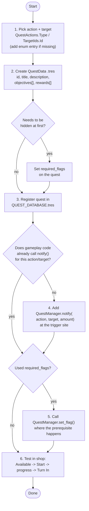

# Adding a Quest

1. **Pick action/target.** Check `data/questing/objectives/quest_actions.gd`
   (`QuestActions.Type`) and `data/questing/objectives/target_ids.gd`
   (`TargetIds.Id`) for what you need. Add a new enum entry if it's missing
   — only append, never reorder/delete (values are saved as raw ints in
   `.tres` files).

2. **Create the quest resource.** In `data/questing/quests/`, new
   `QuestData` resource. Fill in `id`, `title`, `description`, one or more
   `QuestObjective`s (`action` + `target` + `amount`), and `rewards`
   (`QuestReward`, pick `type` first). Optionally set `required_flags` if it
   should stay hidden until a flag is set.

3. **Register it.** Add the new `.tres` to the `quests` array in
   `data/questing/quest_database/QUEST_DATABASE.tres`. Not in this array =
   never shows up, regardless of flags.

4. **Fire the event.** Make sure the gameplay code for that action calls
   `QuestManager.notify(QuestActions.Type.X, TargetIds.Id.Y, amount)`. Skip
   if it already does (e.g. all rock mining already calls this from
   `entities/rocks/rock.gd:_on_rock_death()`). This only records progress —
   it does not auto-complete or auto-grant.

5. **(Optional) Gate with a flag.** If you used `required_flags`, call
   `QuestManager.set_flag(&"your_flag")` wherever that prerequisite event
   happens.

6. **Test in-game.** Open the shop, confirm the quest shows under
   Available, Start it, trigger the event, watch progress update, Turn In.

That's it — the shop UI (`ui/shop_ui.gd`, `quest_list_card.gd`,
`quest_detail_panel.gd`) already listens to `QuestManager` signals and
rebuilds itself, so no UI wiring is needed per-quest.

## Known gaps / TODOs in the current implementation

- `QuestReward.RewardType.ITEM`, `DURABILITY`, and `UNLOCK_QUEST` are not
  actually granted yet — `QuestManager._grant()` has `# TODO` stubs for all
  three (`game/quest_manager.gd:55-65`). Only `COINS` currently pays out.
  Don't rely on the other reward types until those TODOs are implemented.
- Flags are only ever loaded from `progress.json` at startup; nothing in
  gameplay code currently calls `set_flag()` at runtime. If you gate a quest
  behind a flag, you need to add the `set_flag()` call yourself.
